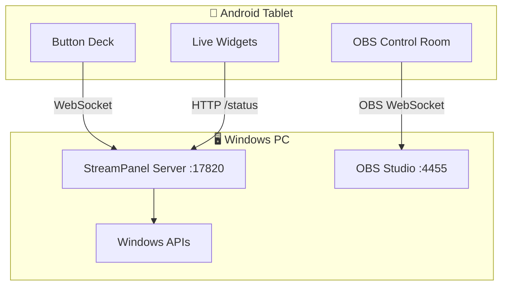
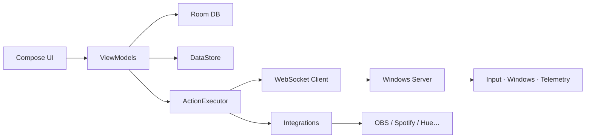

<div align="center">


<br/>

# StreamPanel

**Turn your Android tablet into a premium control deck for your Windows PC.**

Stream · Work · Study · Gaming · Automation · Smart Home — all from one glassy dashboard.

<br/>

[](https://developer.android.com/)
[](https://kotlinlang.org/)
[](https://developer.android.com/jetpack/compose)
[](https://dotnet.microsoft.com/)
[](android/app/build.gradle.kts)
[](#license)

[Quick Start](#-quick-start) · [Features](#-features) · [Screenshots](#-screenshots) · [Architecture](#-architecture) · [Docs](#-documentation) · [Русский](README.ru.md)

</div>

---

## What is StreamPanel?

StreamPanel is a **two-part system**:

| Part | Role |
|------|------|
| **Android app** | Beautiful tablet UI — button deck, widgets, OBS room, macros |
| **Windows server** | Companion on your PC — executes commands, sends live telemetry |

Press a button on the tablet → your PC opens apps, sends hotkeys, switches OBS scenes, snaps windows, or runs a full macro chain.



> **Two connections, not one:** PC server uses port **17820**. OBS uses its own WebSocket on port **4455**.

---

## Features

<table>
<tr>
<td width="50%" valign="top">

### Dashboard & Deck
- Custom grid **2×2 … 12×12**
- Layers, folders, toggle buttons
- Drag & drop layout
- 9 themes + custom accent + glass UI
- Import / export deck as JSON

### Streaming
- **OBS Control Room** — Program / Preview monitors
- Stream, record, pause, studio mode
- Scene cards with thumbnails
- Twitch & YouTube chat embed
- Stream health (FPS, dropped frames)

### Productivity
- Pomodoro focus timer
- Time tracker with projects
- Clipboard sync PC ↔ tablet
- Quick actions row (Alt+Tab, screenshot…)
- Study & meeting mode packs

</td>
<td width="50%" valign="top">

### PC Control
- Open URLs & launch apps
- Hotkeys & typed text
- Window snap, multi-monitor
- Volume, media keys, mouse
- Sleep, lock, task manager, git, docker

### Gaming
- **CS2 Game State Integration**
- Health, armor, ammo, map, score
- Auto-detect game by process name

### Integrations
- OBS WebSocket 5.x
- Spotify · Discord webhook · Streamlabs
- Philips Hue · Home Assistant · MQTT
- TCP / UDP raw packets

</td>
</tr>
</table>

---

## Screenshots

> Illustrations below ship with the repo. Drop real tablet screenshots into `docs/images/` to replace them anytime.

<table>
<tr>
<td align="center" width="50%">

<br/><sub><b>Dashboard</b> — deck + sidebar + tools column</sub>
</td>
<td align="center" width="50%">

<br/><sub><b>OBS Studio</b> — Program / Preview + scene cards</sub>
</td>
</tr>
</table>

<details>
<summary><b>More panels & tools</b></summary>

<br/>

| Panel | What it does |
|-------|----------------|
| Hardware Monitor | CPU, RAM, all drives, network |
| Process Monitor | Top processes, tap to kill |
| Stream Chat | Embedded Twitch / YouTube chat |
| Game Status | CS2 HUD via GSI |
| PC Configurator | Link to web setup on your PC |
| Discord / Dev Tools | Shortcuts for daily workflows |
| Time Tracker | Projects + session log |

</details>

---

## Quick Start

### For users (share with a friend)

```powershell
.\tools\package-friend-bundle.ps1
```

Output: `dist\StreamPanel-FriendBundle.zip` (~93 MB)

| On PC | On tablet |
|-------|-----------|
| Unzip → run `START-SERVER.bat` | Install `StreamPanel.apk` |
| Allow firewall if asked | Settings → PC host = your PC IP |
| Port **17820** | Port **17820** |

Both devices must be on the **same Wi‑Fi network**.

---

### For developers

```powershell
git clone https://github.com/zibirik/streamdeck.git
cd streamdeck
.\tools\check-prereqs.ps1
.\tools\build-all.ps1
.\tools\run-server.ps1
```

Install APK:

```text
android\app\build\outputs\apk\debug\app-debug.apk
```

Full checklist: [`docs/ready-checklist-ru.md`](docs/ready-checklist-ru.md) (RU)

---

## Architecture



| Layer | Tech |
|-------|------|
| Android UI | Kotlin, Jetpack Compose, Material 3, Hilt |
| Persistence | Room (deck), DataStore (settings) |
| Network | Ktor WebSocket + HTTP |
| Windows server | .NET 8, ASP.NET Core Minimal APIs |
| Protocol | JSON over WebSocket v1 |

Deep dive: [`docs/architecture.md`](docs/architecture.md)

---

## Repository structure

```text
streamdeck/
├── android/                 # Kotlin tablet app
│   ├── app/                 # Entry, navigation
│   ├── core/                # model, database, network, execution…
│   └── feature/             # dashboard, editor, settings, obs…
├── server/windows/          # .NET companion server
├── tools/                   # Build & deploy scripts (PowerShell)
├── docs/                    # Architecture, protocol, images
└── dist/                    # Build output (gitignored)
```

---

## Windows server API

Default port: **17820**

| Endpoint | Description |
|----------|-------------|
| `GET /` | PC Configurator web UI |
| `GET /status` | Live PC telemetry |
| `WS /ws` | Command channel from tablet |
| `POST /integrations/cs2/gsi` | Counter-Strike 2 GSI |
| `GET/POST /api/configurator/draft` | Web configurator drafts |

Protocol details: [`docs/protocol.md`](docs/protocol.md)

---

## OBS setup

1. OBS → **Tools → WebSocket Server Settings**
2. Enable server, set password (default port **4455**)
3. In StreamPanel → **OBS Studio**:
   - URL: `ws://YOUR_PC_IP:4455`
   - Password: your OBS password

No need to start streaming manually before connecting — WebSocket works as soon as OBS is open.

---

## Build commands

| Command | Result |
|---------|--------|
| `.\tools\build-all.ps1` | Server + APK + friend bundle |
| `.\tools\build-android.ps1` | Debug APK only |
| `.\tools\build-server.ps1` | Server build |
| `.\tools\package-friend-bundle.ps1` | ZIP for sharing |
| `.\tools\run-server.ps1` | Start server locally |

---

## Troubleshooting

<details>
<summary><b>Tablet can't connect to PC</b></summary>

- Server running? (`START-SERVER.bat` or `run-server.ps1`)
- Correct PC IP? (`ipconfig` → Wi‑Fi IPv4)
- Firewall open? (`ALLOW-FIREWALL.bat`)
- Same Wi‑Fi network, no client isolation on router

</details>

<details>
<summary><b>OBS says wrong stream key / channel error</b></summary>

StreamPanel **did connect** — OBS tried to start the stream but rejected your stream settings.

Fix in OBS: **Settings → Stream** (service, server, stream key).

</details>

<details>
<summary><b>CS2 HUD not updating</b></summary>

1. Download GSI config from `http://PC_IP:17820/` → CS2 HUD tab
2. Place in `csgo/cfg/`
3. Restart CS2
4. Check `http://PC_IP:17820/integrations/cs2/status`

</details>

---

## Documentation

| File | Content |
|------|---------|
| [`docs/architecture.md`](docs/architecture.md) | System design |
| [`docs/protocol.md`](docs/protocol.md) | WebSocket protocol |
| [`docs/plugin-sdk.md`](docs/plugin-sdk.md) | Plugin contracts |
| [`docs/roadmap.md`](docs/roadmap.md) | Roadmap stages |
| [`README.ru.md`](README.ru.md) | Russian README |

---

## Contributing

1. Fork the repo
2. Create a feature branch
3. Run `.\tools\build-all.ps1`
4. Test on a real tablet + Windows PC
5. Open a pull request

---

## License

License not specified yet. Add a `LICENSE` file before public distribution.

---

<div align="center">

**Made for streamers, builders, and power users who want their tablet to feel like mission control.**

<br/>

[⬆ Back to top](#streampanel) · [Русская версия](README.ru.md)

</div>
