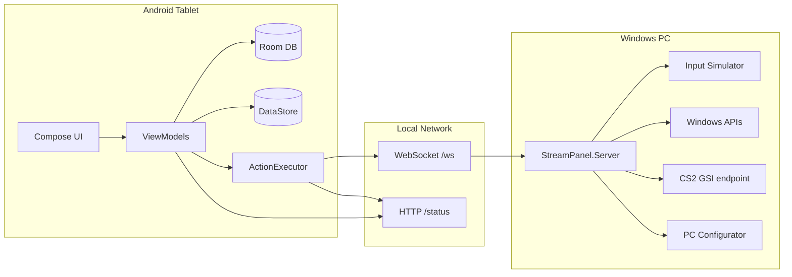

# StreamPanel

**StreamPanel** — это Android-приложение для планшета и Windows companion server, которые вместе превращают планшет в профессиональную панель управления ПК: стриминг, работа, учёба, игры, автоматизация и smart home.

Планшет показывает красивый dashboard с кнопками, виджетами и быстрыми действиями. Windows server принимает команды по WebSocket и выполняет их на ПК: открывает сайты, запускает программы, отправляет hotkeys, управляет окнами, читает telemetry и отдаёт статус обратно в приложение.

Текущая версия Android: **0.1.14** (`versionCode 15`).

---

## Содержание

- [Что умеет StreamPanel](#что-умеет-streampanel)
- [Как это работает](#как-это-работает)
- [Структура репозитория](#структура-репозитория)
- [Быстрый старт](#быстрый-старт)
- [Установка инструментов](#установка-инструментов)
- [Сборка проекта](#сборка-проекта)
- [Запуск и подключение](#запуск-и-подключение)
- [Экраны Android-приложения](#экраны-android-приложения)
- [Dashboard и панели](#dashboard-и-панели)
- [Редактор кнопок и макросы](#редактор-кнопок-и-макросы)
- [OBS Studio интеграция](#obs-studio-интеграция)
- [PC Configurator (веб-настройка с ПК)](#pc-configurator-веб-настройка-с-пк)
- [CS2 HUD / Game Overlay](#cs2-hud--game-overlay)
- [Чат Twitch / YouTube](#чат-twitch--youtube)
- [Настройки приложения](#настройки-приложения)
- [Типы действий (Actions)](#типы-действий-actions)
- [Протокол Android ↔ Windows](#протокол-android--windows)
- [HTTP API Windows server](#http-api-windows-server)
- [Сборка ZIP для друга](#сборка-zip-для-друга)
- [Troubleshooting](#troubleshooting)
- [Документация и roadmap](#документация-и-roadmap)

---

## Что умеет StreamPanel

### Планшет (Android)

| Категория | Возможности |
|-----------|-------------|
| **Dashboard** | Настраиваемая сетка кнопок 2×2 … 12×12, слои/страницы, папки, toggle-кнопки, drag & drop |
| **UI/UX** | Material 3, glassmorphism, 9 тем, кастомный accent, фон, tablet-first layout |
| **Быстрые действия** | Lock, paste, Alt+Tab, screenshot, snap windows, media keys и др. |
| **Виджеты** | CPU/RAM/диски, процессы, Pomodoro, time tracker, clipboard, Discord, stream tools |
| **Стриминг** | OBS control room, Twitch/YouTube chat, stream health, replay buffer |
| **Игры** | CS2 GSI HUD: HP, armor, ammo, map, score |
| **Редактор** | Визуальный editor кнопок + шаблоны макросов + programmable macros |
| **Интеграции** | OBS, Spotify, Discord webhook, Streamlabs, Hue, Home Assistant, MQTT, TCP/UDP |
| **Локализация** | English + Русский |
| **Экспорт/импорт** | Backup deck в JSON |

### Windows Server

| Категория | Возможности |
|-----------|-------------|
| **Команды** | URL, process launch, send text, hotkeys, mouse, media, volume, windows, system |
| **Telemetry** | CPU, RAM, все диски, сеть, foreground app, top processes, clipboard preview |
| **Окна** | Snap left/right, move to monitor, minimize/maximize/close, Alt+Tab, fullscreen |
| **Система** | Sleep, lock, task manager, screenshot, kill process, clean temp, Wi-Fi restart, flush DNS |
| **Dev tools** | Git pull/status, Docker ps/compose up |
| **CS2 GSI** | Приём Game State Integration от Counter-Strike 2 |
| **Web UI** | PC Configurator в браузере: status, chat draft, CS2 setup, macro builder |
| **WebSocket** | `/ws` — основной канал команд с планшета |

---

## Как это работает



### Типичный сценарий

1. На ПК запускается `StreamPanel.Server.exe` (порт **17820**).
2. На планшете в **Настройки → Сервер ПК** указывается IP ПК и порт.
3. Dashboard показывает кнопки из Room DB и live-статус с `/status`.
4. Нажатие кнопки → `ActionExecutor` → WebSocket команда на ПК → Windows выполняет действие.
5. OBS/Spotify/Hue и др. выполняются напрямую с планшета через HTTP/WebSocket клиенты.

Подробнее об архитектуре: [`docs/architecture.md`](docs/architecture.md).

---

## Структура репозитория

```text
streamdeck/
├── android/                          # Android app (Kotlin, Compose, Hilt)
│   ├── app/                          # Entry point, navigation, application
│   ├── core/
│   │   ├── model/                    # Domain models (buttons, actions, settings)
│   │   ├── database/                 # Room: profiles, pages, buttons, actions
│   │   ├── datastore/                # DataStore preferences
│   │   ├── network/                  # WebSocket + HTTP clients to PC
│   │   ├── execution/                # ActionExecutor, macro engine
│   │   ├── integrations/             # OBS, Spotify, Hue, MQTT, Discord...
│   │   └── designsystem/             # Theme, glass UI, panels, strings
│   └── feature/
│       ├── dashboard/                # Main deck + layout zones
│       ├── editor/                   # Button/macro editor
│       ├── settings/                 # Settings + layout customizer
│       ├── connections/              # PC connection screen
│       └── obs/                      # OBS Studio control room
├── server/
│   └── windows/
│       └── StreamPanel.Server/       # .NET 8 Windows companion server
│           ├── Actions/              # Command handler
│           ├── Windows/              # Hardware, clipboard, game telemetry...
│           └── wwwroot/              # PC Configurator (index.html)
├── tools/                            # PowerShell build & deploy scripts
├── docs/                             # Architecture, protocol, checklist
└── dist/                             # Build output (APK bundle, ZIP)
```

---

## Быстрый старт

### Для себя (разработка)

```powershell
cd C:\path\to\streamdeck
.\tools\check-prereqs.ps1
.\tools\build-all.ps1
.\tools\run-server.ps1
```

Установи APK на планшет:

```text
android\app\build\outputs\apk\debug\app-debug.apk
```

В приложении: **Настройки → Сервер ПК → Host = IP вашего ПК, Port = 17820**.

### Для друга (готовый ZIP)

```powershell
.\tools\package-friend-bundle.ps1
```

Готовый архив:

```text
dist\StreamPanel-FriendBundle.zip
```

Внутри: `StreamPanel.apk`, `WindowsServer\StreamPanel.Server.exe`, bat-файлы запуска, `README_RU.txt`.

---

## Установка инструментов

### Автоматически (Windows)

```powershell
.\tools\install-prereqs-windows.ps1 -IncludeAndroidStudio
```

### Вручную

| Инструмент | Версия | Зачем |
|------------|--------|-------|
| [Android Studio](https://developer.android.com/studio) | latest | Android SDK, emulator |
| [.NET 8 SDK](https://dotnet.microsoft.com/download/dotnet/8.0) | 8.x | Windows server |
| [JDK 17](https://adoptium.net/temurin/releases/?version=17) | 17 | Gradle/Kotlin |

Android SDK Platform **35**, Build-Tools, Platform-Tools.

Переменная окружения:

```text
ANDROID_HOME = C:\Users\<you>\AppData\Local\Android\Sdk
```

### Проверка

```powershell
.\tools\check-prereqs.ps1
```

Все пункты должны быть `[ok]`.

Подробный чеклист на русском: [`docs/ready-checklist-ru.md`](docs/ready-checklist-ru.md).

---

## Сборка проекта

| Команда | Что собирает |
|---------|--------------|
| `.\tools\build-all.ps1` | Server + Android + friend bundle |
| `.\tools\build-android.ps1` | Только APK |
| `.\tools\build-server.ps1` | Только server (debug build) |
| `.\tools\package-friend-bundle.ps1` | APK + self-contained EXE + ZIP |

### Android вручную

```powershell
cd android
.\gradlew.bat assembleDebug
```

APK: `android\app\build\outputs\apk\debug\app-debug.apk`

### Windows server вручную

```powershell
dotnet publish server\windows\StreamPanel.Server\StreamPanel.Server.csproj `
  -c Release -r win-x64 --self-contained true `
  /p:PublishSingleFile=true `
  -o dist\WindowsServer
```

---

## Запуск и подключение

### 1. Запуск server на ПК

```powershell
.\tools\run-server.ps1
```

Или из friend bundle:

```text
START-SERVER.bat
```

Проверка в браузере:

```text
http://localhost:17820/status
http://localhost:17820/              ← PC Configurator (HTML)
```

### 2. Узнать IP ПК

```powershell
ipconfig
```

Нужен IPv4 Wi-Fi адаптера, например `192.168.1.76`.

### 3. Настройка на планшете

**Настройки → Сервер ПК:**

| Поле | Значение |
|------|----------|
| Host | IP ПК (например `192.168.1.76`) |
| Port | `17820` |
| Auto connect | включить |

WebSocket URL: `ws://192.168.1.76:17820/ws`

### 4. Firewall

Если планшет не подключается:

```powershell
.\tools\allow-firewall.ps1
```

Или из bundle: `ALLOW-FIREWALL.bat` (от администратора).

### 5. OBS WebSocket (отдельно от PC server)

OBS использует **свой** WebSocket, обычно порт **4455**:

1. OBS → **Tools → WebSocket Server Settings**
2. Включить server, задать пароль
3. В StreamPanel → **OBS Studio** → URL `ws://IP_ПК:4455`, пароль

> PC server (17820) и OBS WebSocket (4455) — это **разные** подключения.

---

## Экраны Android-приложения

| Экран | Route | Описание |
|-------|-------|----------|
| **Dashboard** | `dashboard` | Главный deck, sidebar, tools column |
| **Editor** | `editor/{buttonId}` | Редактор кнопки и actions |
| **Settings** | `settings` | Все настройки, collapsible sections |
| **Layout Customizer** | `layout-customizer` | Порядок зон и панелей dashboard |
| **Connections** | `connections` | Статус подключения к ПК |
| **OBS Studio** | `obs` | Control room: Program/Preview, stream, scenes, chat |

Навигация: [`android/app/src/main/kotlin/com/streampanel/Navigation.kt`](android/app/src/main/kotlin/com/streampanel/Navigation.kt)

---

## Dashboard и панели

Dashboard разделён на **3 зоны** (настраиваются в Layout Customizer):

| Зона | Содержимое |
|------|------------|
| **Sidebar** | Навигация по слоям/страницам, connection status |
| **Deck** | Основная сетка кнопок |
| **Tools Column** | Виджеты-панели |

### Доступные панели

| ID | Название | Что показывает / делает |
|----|----------|-------------------------|
| `HardwareMonitor` | Железо | CPU, RAM, все диски, сеть с ПК |
| `ProcessMonitor` | Процессы | Top processes, kill по tap |
| `DevTools` | Dev & Git | Git, Docker, IDE shortcuts |
| `StreamTools` | Stream Tools | OBS, Twitch, YouTube, replay |
| `StreamChat` | Чат стрима | Embedded Twitch/YouTube chat |
| `GameStatus` | Игровой HUD | CS2 telemetry |
| `PcConfigurator` | PC Configurator | Ссылка на веб-настройку |
| `Discord` | Discord | Open, mute, deafen, PTT |
| `StudyMode` | Study Mode | Focus, study pack, notes |
| `MeetingMode` | Meeting Mode | Mic mute, Discord/Teams/Zoom |
| `Pomodoro` | Focus Timer | Настраиваемый Pomodoro |
| `TimeTracker` | Time Tracker | Проекты + лог времени |
| `Clipboard` | Clipboard | Sync текста ПК ↔ планшет |
| `QuickActions` | Quick Actions | Настраиваемая строка hotkeys |
| `Media` | Media | Now playing, play/pause, tracks |
| `SystemTools` | Windows & System | Sleep, snap, monitors, screenshot |
| `NavigationShortcuts` | Папки | Quick open folders |
| `QuickLaunch` | Quick Launch | Launch apps with icons |

Панели можно скрывать, менять порядок, менять ширину tools column.

---

## Редактор кнопок и макросы

### Как открыть

- **Long press** на кнопку в deck → Editor
- Или tap на пустую ячейку → создать новую кнопку

### Что настраивается

- Title, subtitle, icon
- Background color, gradient
- Row/column position, span (размер на сетке)
- Toggle mode (On/Off actions)
- Folder → переход на другую страницу
- Список actions (последовательное выполнение)

### Шаблоны макросов (MacroTemplate)

**Простые:**

| Шаблон | Действие |
|--------|----------|
| Browser | Запуск Chrome |
| Website | Open URL |
| App | Launch program |
| OBS Stream | ToggleStream |
| Save Replay | SaveReplayBuffer |
| Screenshot | Win+Shift+S |
| Discord Mute | Focus Discord + mute |
| Mic Mute | Toggle system mic |
| Focus Mode | Toggle focus (notifications) |
| Meeting Mute | Ctrl+Shift+M |
| Study Pack | URLs + focus mode |
| Twitch Chat | Popout chat URL |
| YouTube Studio | Studio + live dashboard |
| PC Config | Open configurator |
| CS2 HUD Help | Open GSI setup page |
| Window Layout | Snap left → Alt+Tab → snap right |
| Monitor 2 | Move window to monitor 2 |
| Game Mode | Focus + Discord deafen + OBS replay |
| Stream Start Pack | OBS + dashboards + Discord |
| Work Focus Pack | Focus + Chrome + Notepad |

**Programmable (с MacroProgram):**

| Шаблон | Возможности |
|--------|-------------|
| Program Sequence | Steps: action → delay → action |
| Program Loop | Repeat N times |
| Program Timer | Delay steps |
| Program Condition | If/else по переменным |

Programmable macros поддерживают:

- `MacroStep.RunAction` — выполнить action
- `MacroStep.Delay` — пауза
- `MacroStep.Loop` — цикл
- `MacroStep.Condition` — условие
- `MacroStep.SetVariable` — переменные

---

## OBS Studio интеграция

Экран **OBS Studio** — полноценная control room на планшете.

### Подключение

| Поле | Пример |
|------|--------|
| WebSocket URL | `ws://192.168.1.76:4455` |
| Password | пароль из OBS WebSocket settings |

### Возможности

- **Program / Preview** мониторы с thumbnail сцен
- **Stream**: Start / Stop / Toggle
- **Record**: Start / Stop / Pause / Resume (корректный статус PAUSED)
- **Studio Mode**: Preview → Program transition
- **Scenes**: карточки с preview (`GetSourceScreenshot`)
- **Sources**: mute/unmute inputs
- **Virtual Cam**, Replay Buffer, Save clip
- **Stream Health**: FPS, dropped frames, OBS CPU/RAM
- **Stream service**: service, server, masked key
- **Chat**: Twitch + YouTube прямо в OBS screen

### OBS WebSocket команды

Клиент: [`android/core/integrations/.../ObsWebSocketClient.kt`](android/core/integrations/src/main/kotlin/com/streampanel/core/integrations/ObsWebSocketClient.kt)

Поддерживается OBS WebSocket **v5.x** (Hello → Identify → Request).

Примеры: `ToggleStream`, `StartRecord`, `PauseRecord`, `ResumeRecord`, `GetSceneList`, `SetCurrentProgramScene`, `SetCurrentPreviewScene`, `TriggerStudioModeTransition`, `GetSourceScreenshot`, `ToggleStudioMode`, `GetStreamServiceSettings`.

### Troubleshooting OBS

| Проблема | Решение |
|----------|---------|
| `Channel was closed` | Неверный пароль WebSocket или OBS отклонил auth |
| OBS показывает ошибку ключа при Start Stream | Проблема в OBS → Settings → Stream, не в StreamPanel |
| Preview сцен пустой | OBS не отдал screenshot — переключение сцен всё равно работает |
| Stream вручную работает, с планшета нет | Проверь, не используешь ли Multi RTMP plugin вместо основного stream |

---

## PC Configurator (веб-настройка с ПК)

Открой в браузере на ПК (когда server запущен):

```text
http://localhost:17820/
http://192.168.1.76:17820/configurator
```

### Вкладки

| Tab | Функции |
|-----|---------|
| **Overview** | Machine status, CPU/RAM, drives, active process |
| **Chat** | Twitch channel / YouTube video ID draft |
| **CS2 HUD** | GSI setup, download config, live diagnostics |
| **Deck from PC** | Macro builder, window layout presets |
| **Server** | Connection info |

Draft сохраняется:

- локально в browser localStorage
- на server: `%AppData%\StreamPanel\web-configurator-draft.json`

API:

```text
GET  /api/configurator/draft
POST /api/configurator/draft
```

---

## CS2 HUD / Game Overlay

StreamPanel может показывать игровую telemetry Counter-Strike 2 через **Game State Integration (GSI)**.

### Настройка

1. Server запущен на ПК
2. Открой `http://IP:17820/` → вкладка **CS2 HUD**
3. Скачай `gamestate_integration_streampanel.cfg`
4. Положи в:

```text
Steam\steamapps\common\Counter-Strike Global Offensive\game\csgo\cfg\
```

5. Перезапусти CS2
6. На планшете включи **Game Status** panel и **Game Overlay** в настройках

### Что показывается

- HP, armor, ammo (clip/reserve)
- Map, phase, score
- Process detection даже без GSI (по exe pattern)

### API

```text
POST /integrations/cs2/gsi          ← CS2 отправляет JSON сюда
GET  /integrations/cs2/status       ← diagnostics
GET  /integrations/cs2/config       ← raw cfg template
GET  /integrations/cs2/download-config
```

Настройки в приложении: **Настройки → Игровой оверлей** — patterns exe, что показывать.

---

## Чат Twitch / YouTube

**Настройки → Чат стрима:**

| Поле | Пример |
|------|--------|
| Twitch channel | `your_channel` |
| YouTube video ID | `jfKfPfyJRdk` |
| Show Twitch / YouTube | toggles |
| Embed in dashboard | WebView в панели |

Чат также встроен в **OBS Studio** screen.

URLs:

- Twitch: `https://www.twitch.tv/popout/{channel}/chat?popout=`
- YouTube: `https://www.youtube.com/live_chat?v={videoId}&embed_domain=www.youtube.com`

---

## Настройки приложения

Все настройки в collapsible sections (не одна простыня полей):

| Раздел | Что настраивает |
|--------|-----------------|
| **Язык** | English / Русский |
| **Авто-слой** | Смена page по foreground app на ПК |
| **Сервер ПК** | Host, port, auto connect, PIN |
| **Layout** | Link to layout customizer |
| **Чат стрима** | Twitch, YouTube, embed options |
| **Игровой оверлей** | CS2 patterns, HP/ammo/map/score toggles |
| **Оформление** | Theme, accent, glass, corner radius, background |
| **Сетка** | Rows/columns per layer |
| **Quick Actions** | Какие кнопки в quick row |
| **Quick Launch** | Apps with paths and icons |
| **Time Tracker** | Projects, log entries |
| **Navigation Folders** | Explorer shortcuts |
| **URL Groups** | Multi-link groups (`\|` separator) |
| **Import / Export** | JSON deck backup |

---

## Типы действий (Actions)

Полный enum: [`android/core/model/.../Models.kt`](android/core/model/src/main/kotlin/com/streampanel/core/model/Models.kt)

### Команды на ПК (через WebSocket)

| ActionType | Payload | Описание |
|------------|---------|----------|
| `OpenUrl` | `url` | Открыть URL в браузере |
| `LaunchProcess` | `path` | Запуск exe/file/folder |
| `SendText` | `text` | Unicode text в active window |
| `Hotkey` | `keys` | Например `CTRL+SHIFT+M` |
| `MouseCommand` | `command` | move, click, scroll |
| `MediaCommand` | `action` | play/pause, next, prev |
| `VolumeCommand` | `action` | up/down/mute/mic_mute_toggle |
| `WindowCommand` | `action` | snap, move_monitor, close... |
| `SystemCommand` | `name` | sleep, screenshot, git_pull... |
| `OpenFolder` | `path` | Explorer |
| `OpenUrlGroup` | `urls` | Несколько URL через `\|` |
| `Delay` | `durationMs` | Пауза (local) |
| `HttpRequest` | url, method, body | HTTP call |
| `TcpPacket` / `UdpPacket` | host, port, message | Raw sockets |
| `Sequence` | macro JSON | Programmable macro |
| `NavigatePage` | `pageId` | Переход на слой |

### Внешние интеграции (с планшета)

| ActionType | Нужные credentials |
|------------|-------------------|
| `ObsCommand` | OBS WebSocket URL + password |
| `SpotifyCommand` | OAuth token |
| `DiscordWebhook` | webhook URL |
| `StreamlabsCommand` | API token |
| `HueCommand` | bridge URL + app key |
| `HomeAssistant` | base URL + long-lived token |
| `Mqtt` | broker host, topic, message |

Executor: [`android/core/execution/.../ActionExecutor.kt`](android/core/execution/src/main/kotlin/com/streampanel/core/execution/ActionExecutor.kt)

### Windows SystemCommand (server-side)

| name | Действие |
|------|----------|
| `lock` | Lock workstation |
| `sleep` | Sleep PC |
| `task_manager` | Ctrl+Shift+Esc |
| `screenshot` | Win+Shift+S |
| `kill_process` / `kill_process_pid` | Kill process |
| `clean_temp` | Clean temp folders |
| `focus_mode_on/off` | Focus mode |
| `git_pull`, `git_status` | Git commands |
| `docker_ps`, `docker_compose_up` | Docker |
| `wifi_restart`, `flush_dns` | Network |
| `empty_recycle_bin` | Empty recycle bin |
| `discord_mute`, `discord_deafen`, `discord_ptt` | Discord hotkeys |

---

## Протокол Android ↔ Windows

WebSocket endpoint: **`ws://HOST:17820/ws`**

Protocol version: **1**

### Command (планшет → ПК)

```json
{
  "id": "a8a22942-2fe4-46d2-b1dd-5eb0467e46cb",
  "protocolVersion": 1,
  "type": "OPEN_URL",
  "payload": {
    "url": "https://example.com"
  },
  "createdAtEpochMs": 1760000000000
}
```

### Response (ПК → планшет)

```json
{
  "id": "a8a22942-2fe4-46d2-b1dd-5eb0467e46cb",
  "ok": true,
  "message": "Opened URL",
  "completedAtEpochMs": 1760000001000
}
```

### Command types

`OPEN_URL`, `LAUNCH_PROCESS`, `SEND_TEXT`, `HOTKEY`, `MOUSE_COMMAND`, `MEDIA_COMMAND`, `VOLUME_COMMAND`, `WINDOW_COMMAND`, `SYSTEM_COMMAND`, `OPEN_FOLDER`, `OPEN_URLS`, `CUSTOM`

Подробнее: [`docs/protocol.md`](docs/protocol.md)

---

## HTTP API Windows server

Default port: **17820**

| Endpoint | Method | Описание |
|----------|--------|----------|
| `/` | GET | PC Configurator HTML |
| `/configurator` | GET | Alias для configurator |
| `/api` | GET | Server info JSON |
| `/status` | GET | Full PC telemetry |
| `/ws` | WS | Command channel |
| `/api/configurator/draft` | GET/POST | Web configurator draft |
| `/integrations/cs2/gsi` | GET/POST | CS2 GSI info / receive |
| `/integrations/cs2/status` | GET | GSI diagnostics |
| `/integrations/cs2/config` | GET | GSI cfg template |
| `/integrations/cs2/download-config` | GET | Download .cfg file |

### `/status` response (ключевые поля)

```json
{
  "machineName": "DESKTOP-PC",
  "cpuPercent": 12.5,
  "ramPercent": 45.2,
  "storageDrives": [
    { "name": "C:", "label": "System", "freeGb": 120.5, "freePercent": 42.1 }
  ],
  "downloadMbps": 15.2,
  "uploadMbps": 5.1,
  "foregroundProcess": "obs64.exe",
  "gameInfo": { "detected": true, "health": 87 },
  "clipboardPreview": "...",
  "recentCommands": []
}
```

---

## Сборка ZIP для друга

```powershell
cd C:\path\to\streamdeck
.\tools\package-friend-bundle.ps1
```

### Что создаётся

```text
dist/
├── StreamPanel-FriendBundle.zip      ← отправь другу
└── StreamPanel-FriendBundle/
    ├── StreamPanel.apk
    ├── WindowsServer/
    │   └── StreamPanel.Server.exe    ← self-contained, .NET не нужен
    ├── START-SERVER.bat
    ├── STOP-SERVER.bat
    ├── ALLOW-FIREWALL.bat
    └── README_RU.txt
```

### Инструкция для друга

**На ПК:**

1. Распаковать ZIP
2. Запустить `START-SERVER.bat`
3. При необходимости `ALLOW-FIREWALL.bat`
4. Узнать IP: `ipconfig`

**На телефоне/планшете:**

1. Установить `StreamPanel.apk`
2. Настройки → Host = IP ПК, Port = 17820
3. Подключить

> Телефон и ПК должны быть в **одной Wi‑Fi сети**.

---

## Troubleshooting

### Планшет не подключается к ПК

- [ ] Server запущен (`START-SERVER.bat`)
- [ ] IP правильный (`ipconfig`, не localhost)
- [ ] Port 17820 открыт в firewall
- [ ] Оба устройства в одной сети
- [ ] VPN/изоляция клиентов на роутере отключена

### OBS не подключается

- [ ] OBS WebSocket включён (Tools → WebSocket Server Settings)
- [ ] URL `ws://IP:4455`, не 17820
- [ ] Пароль совпадает
- [ ] OBS запущен

### CS2 HUD не работает

- [ ] GSI config в правильной папке csgo/cfg
- [ ] CS2 перезапущен после установки cfg
- [ ] Server доступен по IP (не 127.0.0.1 в cfg для другого ПК)
- [ ] Проверь `/integrations/cs2/status`

### Чат не показывается

- [ ] Twitch channel / YouTube video ID заполнены
- [ ] Embed включён в настройках
- [ ] Для YouTube нужен live stream с chat

### Android build fails

```powershell
cd android
.\gradlew.bat --stop
.\gradlew.bat clean assembleDebug --no-daemon
```

### Server build fails (file locked)

Server уже запущен — останови:

```powershell
.\tools\stop-server.ps1
```

---

## Документация и roadmap

| Файл | Описание |
|------|----------|
| [`docs/architecture.md`](docs/architecture.md) | Архитектура Android + server |
| [`docs/protocol.md`](docs/protocol.md) | WebSocket protocol |
| [`docs/plugin-sdk.md`](docs/plugin-sdk.md) | Plugin API contracts |
| [`docs/roadmap.md`](docs/roadmap.md) | Stages 1–7 roadmap |
| [`docs/ready-checklist-ru.md`](docs/ready-checklist-ru.md) | Чеклист готовности (RU) |

### Roadmap highlights

- **Stage 1 (MVP)**: ✅ Dashboard, editor, WebSocket, Windows commands
- **Stage 2**: Drag & drop, GIF/icons
- **Stage 3**: ✅ OBS integration
- **Stage 4**: ✅ Macro engine (conditions, loops, timers)
- **Stage 5**: ✅ Integrations (Spotify, Hue, MQTT...)
- **Stage 6**: Plugin runtime
- **Stage 7**: Release (Play Store, signing, crash reporting)

---

## Tech Stack

| Component | Stack |
|-----------|-------|
| Android | Kotlin, Jetpack Compose, Material 3, Hilt, Room, DataStore, Navigation, Coroutines, Ktor |
| Windows Server | .NET 8, ASP.NET Core Minimal APIs, WebSocket |
| Build | Gradle 8.x, PowerShell scripts |
| Serialization | kotlinx.serialization, System.Text.Json |

---

## Contributing

1. Fork / clone repo
2. Create branch
3. Run `.\tools\check-prereqs.ps1` and `.\tools\build-all.ps1`
4. Test on real tablet + Windows PC
5. Open PR with description of changes

---

## License

License not specified yet. Add a LICENSE file before public release.
