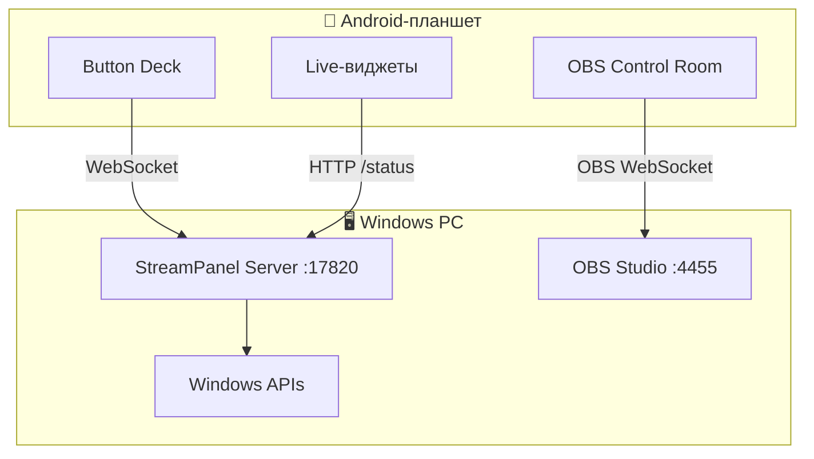
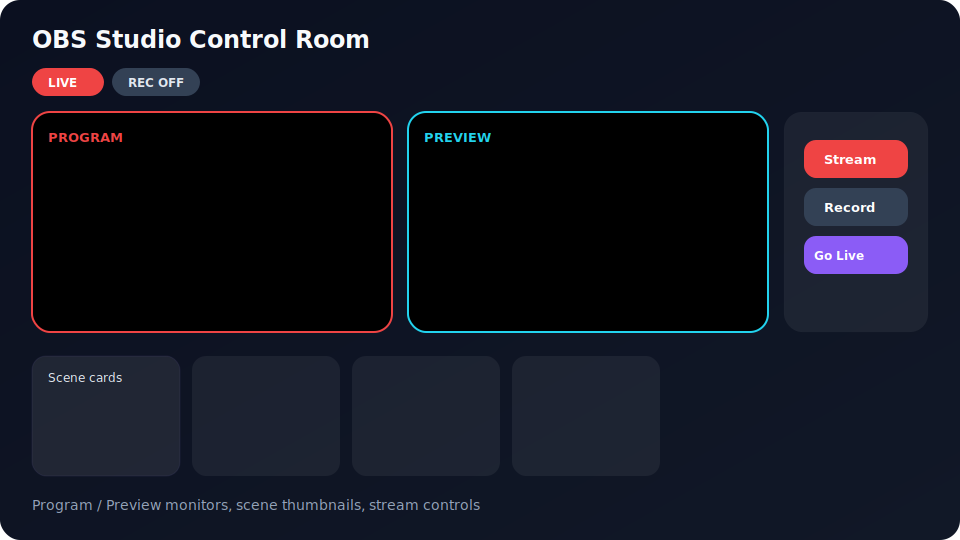
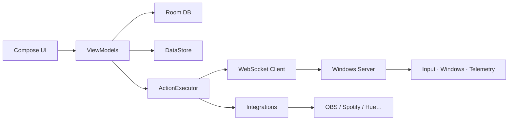

<div align="center">


<br/>

# StreamPanel

**Преврати Android-планшет в стильную панель управления для Windows PC.**

Стриминг · Работа · Учёба · Игры · Автоматизация · Smart Home — всё с одного dashboard.

<br/>

[](https://developer.android.com/)
[](https://kotlinlang.org/)
[](https://developer.android.com/jetpack/compose)
[](https://dotnet.microsoft.com/)
[](android/app/build.gradle.kts)
[](#лицензия)

[Быстрый старт](#-быстрый-старт) · [Функции](#-функции) · [Скриншоты](#-скриншоты) · [Архитектура](#-архитектура) · [Документация](#-документация) · [English](README.md)

</div>

---

## Что такое StreamPanel?

StreamPanel — это **две части**, которые работают вместе:

| Компонент | Роль |
|-----------|------|
| **Android-приложение** | Красивый UI на планшете — deck, виджеты, OBS room, макросы |
| **Windows server** | Companion на ПК — выполняет команды, отдаёт telemetry |

Нажал кнопку на планшете → ПК открывает программы, шлёт hotkeys, переключает сцены OBS, расставляет окна или запускает цепочку макросов.



> **Два подключения, не одно:** PC server — порт **17820**. OBS — свой WebSocket на порту **4455**.

---

## Функции

<table>
<tr>
<td width="50%" valign="top">

### Dashboard и Deck
- Сетка **2×2 … 12×12**
- Слои, папки, toggle-кнопки
- Drag & drop
- 9 тем + accent + glass UI
- Импорт / экспорт deck в JSON

### Стриминг
- **OBS Control Room** — Program / Preview
- Stream, record, pause, studio mode
- Карточки сцен с preview
- Twitch & YouTube chat
- Stream health (FPS, dropped frames)

### Продуктивность
- Pomodoro / Focus timer
- Time tracker с проектами
- Clipboard PC ↔ планшет
- Quick actions (Alt+Tab, screenshot…)
- Study & meeting packs

</td>
<td width="50%" valign="top">

### Управление ПК
- URL и запуск программ
- Hotkeys и ввод текста
- Snap окон, несколько мониторов
- Громкость, media keys, мышь
- Sleep, lock, task manager, git, docker

### Игры
- **CS2 Game State Integration**
- HP, armor, ammo, map, score
- Авто-детект игры по exe

### Интеграции
- OBS WebSocket 5.x
- Spotify · Discord · Streamlabs
- Philips Hue · Home Assistant · MQTT
- TCP / UDP

</td>
</tr>
</table>

---

## Скриншоты

> Ниже — иллюстрации из репозитория. Можешь заменить их реальными скринами планшета в `docs/images/`.

<table>
<tr>
<td align="center" width="50%">

<br/><sub><b>Dashboard</b> — deck + sidebar + tools column</sub>
</td>
<td align="center" width="50%">

<br/><sub><b>OBS Studio</b> — Program / Preview + scene cards</sub>
</td>
</tr>
</table>

<details>
<summary><b>Ещё панели и инструменты</b></summary>

<br/>

| Панель | Что делает |
|--------|------------|
| Hardware Monitor | CPU, RAM, все диски, сеть |
| Process Monitor | Top processes, kill по tap |
| Stream Chat | Twitch / YouTube chat |
| Game Status | CS2 HUD через GSI |
| PC Configurator | Веб-настройка с ПК |
| Discord / Dev Tools | Ярлыки для работы |
| Time Tracker | Проекты + лог времени |

</details>

---

## Быстрый старт

### Для пользователя (отправить другу)

```powershell
.\tools\package-friend-bundle.ps1
```

Результат: `dist\StreamPanel-FriendBundle.zip` (~93 МБ)

| На ПК | На планшете |
|-------|-------------|
| Распаковать → `START-SERVER.bat` | Установить `StreamPanel.apk` |
| Разрешить firewall | Настройки → IP ПК |
| Порт **17820** | Порт **17820** |

Оба устройства — в **одной Wi‑Fi сети**.

---

### Для разработчика

```powershell
git clone https://github.com/zibirik/streamdeck.git
cd streamdeck
.\tools\check-prereqs.ps1
.\tools\build-all.ps1
.\tools\run-server.ps1
```

APK:

```text
android\app\build\outputs\apk\debug\app-debug.apk
```

Полный чеклист: [`docs/ready-checklist-ru.md`](docs/ready-checklist-ru.md)

---

## Архитектура



| Слой | Стек |
|------|------|
| Android UI | Kotlin, Jetpack Compose, Material 3, Hilt |
| Хранение | Room (deck), DataStore (настройки) |
| Сеть | Ktor WebSocket + HTTP |
| Windows server | .NET 8, ASP.NET Core Minimal APIs |
| Протокол | JSON over WebSocket v1 |

Подробнее: [`docs/architecture.md`](docs/architecture.md)

---

## Структура репозитория

```text
streamdeck/
├── android/                 # Kotlin tablet app
│   ├── app/                 # Entry, navigation
│   ├── core/                # model, database, network, execution…
│   └── feature/             # dashboard, editor, settings, obs…
├── server/windows/          # .NET companion server
├── tools/                   # PowerShell build scripts
├── docs/                    # Architecture, protocol, images
└── dist/                    # Build output (gitignored)
```

---

## Windows server API

Порт по умолчанию: **17820**

| Endpoint | Описание |
|----------|----------|
| `GET /` | PC Configurator (веб UI) |
| `GET /status` | Live telemetry ПК |
| `WS /ws` | Команды с планшета |
| `POST /integrations/cs2/gsi` | Counter-Strike 2 GSI |
| `GET/POST /api/configurator/draft` | Draft веб-конфигуратора |

Протокол: [`docs/protocol.md`](docs/protocol.md)

---

## Настройка OBS

1. OBS → **Tools → WebSocket Server Settings**
2. Включить server, задать пароль (порт **4455**)
3. В StreamPanel → **OBS Studio**:
   - URL: `ws://IP_ПК:4455`
   - Password: пароль OBS

Трансляцию вручную начинать не нужно — WebSocket работает, пока OBS открыт.

---

## Команды сборки

| Команда | Результат |
|---------|-----------|
| `.\tools\build-all.ps1` | Server + APK + friend bundle |
| `.\tools\build-android.ps1` | Только APK |
| `.\tools\build-server.ps1` | Только server |
| `.\tools\package-friend-bundle.ps1` | ZIP для друга |
| `.\tools\run-server.ps1` | Запуск server |

---

## Troubleshooting

<details>
<summary><b>Планшет не подключается к ПК</b></summary>

- Server запущен? (`START-SERVER.bat`)
- Верный IP? (`ipconfig` → Wi‑Fi IPv4)
- Firewall? (`ALLOW-FIREWALL.bat`)
- Одна Wi‑Fi сеть, без client isolation на роутере

</details>

<details>
<summary><b>OBS пишет ошибку ключа / канала</b></summary>

StreamPanel **подключился** — OBS попытался начать эфир, но отклонил настройки трансляции.

Исправь в OBS: **Settings → Stream** (сервис, server, stream key).

</details>

<details>
<summary><b>CS2 HUD не обновляется</b></summary>

1. Скачай GSI config: `http://IP_ПК:17820/` → вкладка CS2 HUD
2. Положи в `csgo/cfg/`
3. Перезапусти CS2
4. Проверь `http://IP_ПК:17820/integrations/cs2/status`

</details>

---

## Документация

| Файл | Содержание |
|------|------------|
| [`docs/architecture.md`](docs/architecture.md) | Архитектура |
| [`docs/protocol.md`](docs/protocol.md) | WebSocket протокол |
| [`docs/plugin-sdk.md`](docs/plugin-sdk.md) | Plugin API |
| [`docs/roadmap.md`](docs/roadmap.md) | Roadmap |
| [`docs/ready-checklist-ru.md`](docs/ready-checklist-ru.md) | Чеклист готовности |
| [`README.md`](README.md) | English README |

---

## Contributing

1. Fork репозитория
2. Feature branch
3. `.\tools\build-all.ps1`
4. Тест на реальном планшете + Windows PC
5. Pull request

---

## Лицензия

Лицензия пока не указана. Добавь `LICENSE` перед публичным релизом.

---

<div align="center">

**Для стримеров, разработчиков и всех, кто хочет превратить планшет в центр управления.**

<br/>

[⬆ Наверх](#streampanel) · [English version](README.md)

</div>
