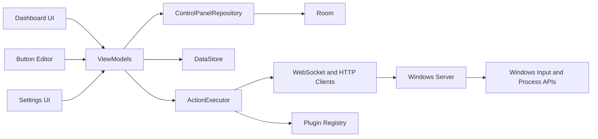

# Architecture

StreamPanel is split into an Android tablet client and a Windows companion server.

## Android Layers

- `app`: application entry point, Hilt setup and navigation.
- `core:model`: stable domain models shared across features.
- `core:database`: Room entities, DAOs, seed data and repository implementation.
- `core:datastore`: user preferences and server settings.
- `core:network`: WebSocket and HTTP clients.
- `core:execution`: action dispatcher and simple macro execution.
- `core:plugin-api`: extension contracts for future plugins.
- `core:designsystem`: Material 3 theme, glass surfaces and reusable tablet controls.
- `feature:*`: dashboard, editor, settings, connections and OBS-facing UI.

## Data Flow

1. Room stores profiles, pages, buttons and actions.
2. ViewModels expose immutable UI state with `StateFlow`.
3. Compose screens render tablet-first layouts.
4. Button presses are routed to `ActionExecutor`.
5. Local HTTP actions use the Android network layer.
6. PC actions are serialized into the shared JSON protocol and sent to the Windows server.

## Plugin Boundary

The MVP exposes plugin contracts but does not load third-party binaries. Future plugin stages can register action providers, button renderers and settings screens through the same interfaces without changing feature modules.
